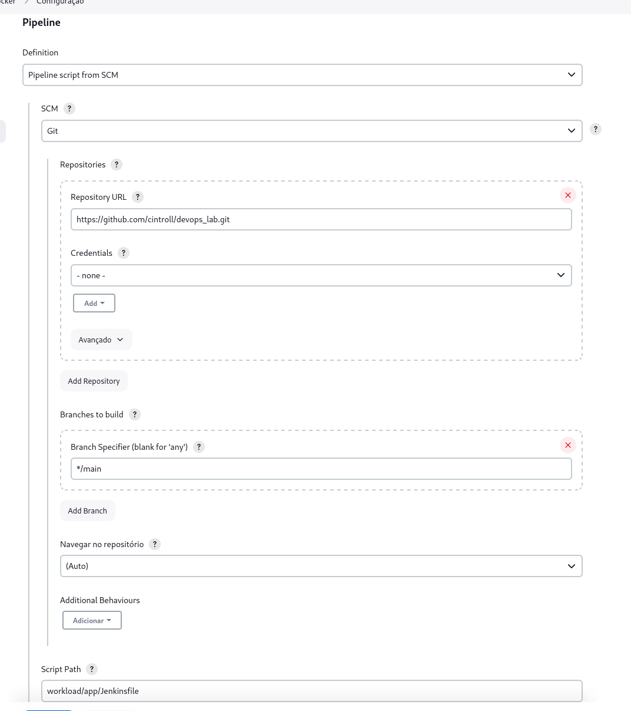

# Laborario Devops

## Arquitetura

### Infra

Cluster EKS hospedado na AWS onde iremos hospedar as aplicações e as aplicações que iram suportar nosso ambiende Devops (Grafana, Prometheus, Promtail e Loki). Para orquestrar o CI/CD iremos utilizar um Jenkins hospedado em uma EC2.

Toda essa infra será criada e configurada usando terraform e ansible, respectivamente.

### Aplicações

#### Aplicação Exemplo

A [aplicação de exemplo](workload/app/app.py) foi criado em Python usando a biblioteca Flask. O seu deploy utiliza uma [imagem docker](workload/app/Dockerfile) e configurado via um [manifesto kubernetes](workload/app/deployment.yaml).
Os [testes](workload/app/tests/test_hello_world.py) foram implementados com o uso da biblioteca Pytest.
Os [pipeline](workload/app/Jenkinsfile) foi configurado usando Jenkins.

#### Grafana

Para disponibilizarmos os logs e metricas foi disponibilizado o grafana, sendo configurado via [manifestos kubernetes](workload/grafana/) e deploy realizado com [terraform](cluster/observability.tf).

#### Promtail e Loki

Para a coleta e centralização dos logs foi configuradas as ferramentas promtail e loki, sendo configurados usando seus respectivos [helm chats](https://github.com/grafana/helm-charts) e deploy realizado com [terraform](cluster/observability.tf).

#### Prometheus

Para a coleta e centralização das metricas foi configurado o prometheus, sendo configurado usando [helm chart](https://github.com/prometheus-community/helm-charts) e deploy realizado com [terraform](cluster/observability.tf).

## Iniciando o laboratorio

### Pré requisitos

* Terraform
* Ansible
* Kubectl
* AWS CLI
* [aws-iam-authenticator](https://docs.aws.amazon.com/eks/latest/userguide/install-aws-iam-authenticator.html) 
* Ambiente Linux **Todo esse ambiente foi projeto e testado em Linux**

### Criando Infra

Usando o terraform iremos disponibilizar toda a infra (EKS e EC2) e também irá configura a parte de observabilidade

```shell
cd cluster
terraform init
terraform apply
chmod 0400 devops_rsa.pem
aws eks update-kubeconfig --name $(terraform output -raw cluster_name) --region $(terraform output -raw region) # Autentica o kubectl com o EKS
```

### Configurando o Grafana 

Iremos configurar o grafana e seus data sources

1. Fazendo Deploy do grafana
    ```shell
    cd workload/grafana
    kubectl apply -f pvc.yaml
    kubectl apply -f deployment.yaml
    kubectl apply -f service.yaml
    kubectl apply -f ingress.yaml
    ```
1. Recuperar e acessar URL do Grafana
    ```shell
    kubectl get ingress -n observability 
    ```
1. Logar o admin e admin
1. Criar um data source para o loki:
    * Tipo: Loki
    * URL: http://loki.observability:3100
1. Criar um data source para o prometheus:
    * Tipo: Prometheus
    * URL: http://prometheus-server.observability
1. Importar um dashboard para monitorar as metricas do Cluster EKS
    1. Importar o dashboard com [ID 315](https://grafana.com/grafana/dashboards/315-kubernetes-cluster-monitoring-via-prometheus/)
1. Importar um dashboard para monitorar os logs do Cluster EKS
    1. Importar o dashboard com [ID 15141](https://grafana.com/grafana/dashboards/15141-kubernetes-service-logs/)


### Configura Jenkins

Iremos configurar o servidor Jenkins usando ansible

```shell
cd workload/jenkins-ci/ansible
EC2_DNS=\"$(terraform -chdir=../../../cluster output -raw jenkins_dns)\" envsubst < inventary.yaml.template > inventary.yaml
ansible-playbook -i inventary.yaml jenkins_playbook.yaml --private-key=../../../cluster/devops_rsa.pem --extra-vars="cluster_name='$(terraform -chdir=../../../cluster output -raw cluster_name)' endpoint='$(terraform -chdir=../../../cluster output -raw cluster_endpoint)' certificate='$(terraform -chdir=../../../cluster output -raw cluster_certificate_authority_data)' token='$(terraform -chdir=../../../cluster output -raw devops_service_token)'"
```

#### Configurando o pipeline Jenkins

1. Acessar o jenkins usando o DNS da EC2 na porta 8080, o mesmo pode ser recuperado a partir da saida do terraform.
    ```shell
    cd cluster
    terraform output -raw jenkins_dns
    ```
1. No primeiro acesso será necessario recuperar a senha inicial, para isso basta rodar os comandos
    ```shell
    cd cluster
    ssh -i ./devops_rsa.pem ec2-user@`terraform output -raw jenkins_dns` 'sudo cat /var/lib/jenkins/secrets/initialAdminPassword'
    ```
1. Configura o jenkins com os plugins padrões e criar um usuario e senha
1. Criar um job do tipo pipeline com o seguintes dados:
    * Repositorio: https://github.com/cintroll/devops_lab.git
    * Branch: */main
    * Jenkinsfile: workload/app/Jenkinsfile
    
1. Ir até o Job configurado e disparar um build/deploy
1. A URL do serviço deve ser mostrado no pipeline, caso não apareça rodar o comando abaixo:
    ```shell
    kubectl get ingress -n app-python 
    ```
1. Acessar a URL recuperada via Browser ou via curl
1. As metricas do app podem ser vistas no Explore do cassandra usando a seguinte query
    ```promql
    flask_http_request_total
    ```

### Destruindo o laboratorio

```bash
cd workload/app/
kubectl delete -f deployment.yaml
cd workload/grafana/
kubectl delete -f pvc.yaml
kubectl delete -f deployment.yaml
kubectl delete -f service.yaml
kubectl delete -f ingress.yaml
cd ../../cluster
terraform destroy
```

O comando **terraform destroy** pode dar erro, pois o ECR esta vazio, para resolver basta remover as imagens via AWS Console e o **terraform destroy** novamente.